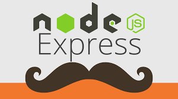

# Webserver básico con Nodejs, Expressjs, hbs.



## Requisitos para correr el programa
- Tener instalado Nodejs
- Ejecutar los siguientes comandos
```
npm install
```
```
npm run dev
```
## En caso de error con Nodemon, ejecutar el siguiente comando

```
node server.js
```